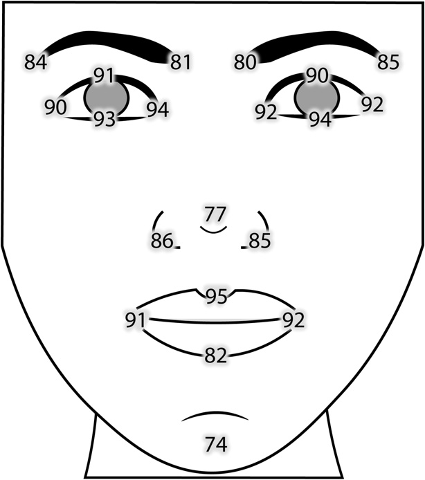
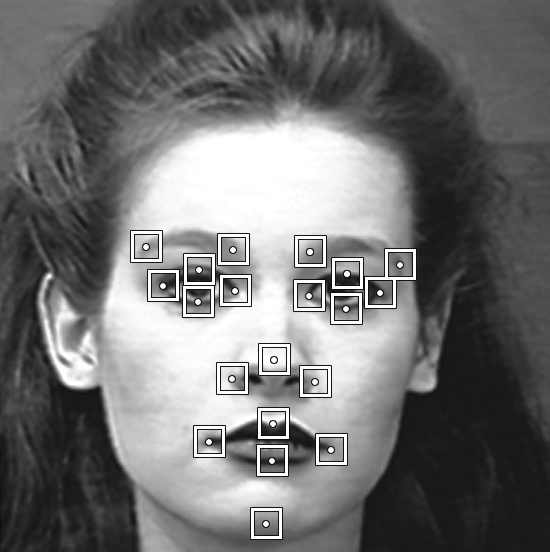

## Face Landmark Detection

This paper shows an implementation of a system for face landmark detection on a portrait. Haar-like features detect certain patterns using illumination difference in particular adjacent rectangles and are used for face detection. Key points on detected face are located using illumination delta histograms whose global peaks mark pupils and lips. Facial landmarks mark 20 specific facial points which can be seen on Figure 8. They are classified using GentleBoost classification algorithm which is an ensemble method that uses vast number of weaker classification algorithms, such as decision trees, to improve their common performance. Feature vectors for GentleBoost algorithm consist of 49 layers. First 48 layers represent image filtered using diffrent Gabor filters, and the last layer is luminance. System is tested on Extended Cohn-Kanade database, and achieves 72% accuracy for key point detection and 88% accuracy for face landmark classification after 10 000 iterations of training.

## Izdvajanje karakterističnih obeležja lica

Cilj ovog rada je realizacija sistema za izdvajanje karakterističnih obeležja lica na portretu. Za pronalaženje lica na fotografiji korišćene su *Haar* odlike, za izdvajanje ključnih tačaka korišćeni su histogrami osvetljenja, a za izdvajanje karakteristiènih obeležja je korišćen GentleBoost klasifikacioni algoritam. Vektor odlika, na osnovu kojeg se vrši klasifikacija, se sastoji od 49 slojeva, gde se prvih 48 dobija filtriranjem slike različitim Gaborovim filtrima, a poslednji sloj predstavlja luminansu slike. U radu je korišćena Extended Cohn-Kanade baza fotografija, na kojoj je postignuta tačnost od 72% za izdvajanje kljuènih taèaka, a tačnost klasifikacije karakterističnih obeležja je bila 88% nakon 10 000 trening iteracija.

|  |  |
| -- | -- |
| Landmark detection accuracy in percentages | Example showing derived regions of interest |
| Tačnost izdvajanja obeležja u procentima | Primer sa izdvojenim regionima interesa |